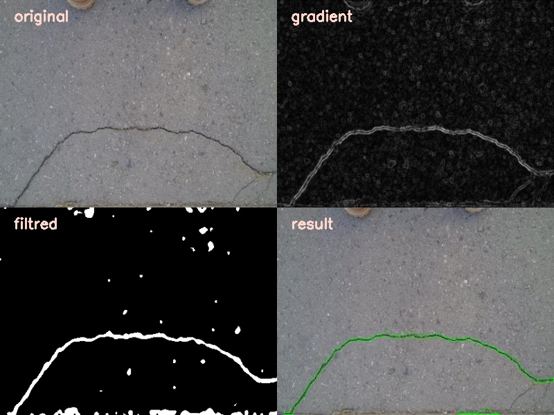
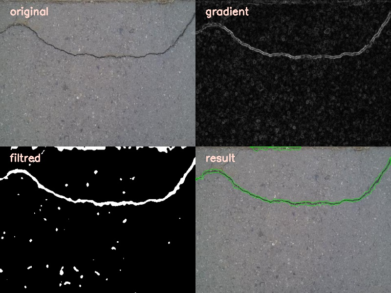
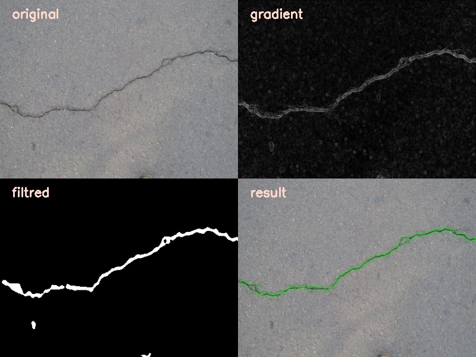

# 🛣️ Road Crack Detection (C++ / OpenCV)

  
  
  

--------------------------------------------------------------------------
### 📌 ***Description***

This project implements a complete road crack detection pipeline from images, using C++ and OpenCV.

The algorithm is based on classical image processing techniques:

gradient computation

automatic binarization (Otsu)

morphological operations

contour detection and filtering

The project is modularly structured (classes) and allows:

single-image processing

batch processing via a Bash script

full pipeline visualization in a single window

--------------------------------------------------------------------------

### 🧠 ***Processing Pipeline***

Original image

Gradient (Sobel X/Y)

Segmentation (binarization + morphological cleaning)

Final result (detected cracks)

All steps can be displayed simultaneously in a 2×2 grid.

--------------------------------------------------------------------------

### ⚙️ ***Dependencies***

C++17

OpenCV ≥ 4

CMake ≥ 3.10

Linux (tested on Ubuntu)

OpenCV installation:

sudo apt install libopencv-dev

### 🔨 *** Compilation***

mkdir build
cd build
cmake ..
make

***Generated executable:***
build/RoadCrackDetection

--------------------------------------------------------------------------

### ▶️ ***Usage (Single Image)***

./RoadCrackDetection <input_image> <output_image>

***Example:***

./RoadCrackDetection ../data/images/001.jpg ../data/output/001.jpg

--------------------------------------------------------------------------

### 🔁 ***Batch Processing***

A Bash script is provided to process all images in a directory.

📜 ***run_all.sh Script***

#!/bin/bash

IMG_DIR="../data/images"
OUT_DIR="../data/output"
EXEC="../build/RoadCrackDetection"

mkdir -p "$OUT_DIR"
shopt -s nullglob

for img in "$IMG_DIR"/*.jpg; do
    echo "Processing $img ..."
    "$EXEC" "$img" "$OUT_DIR/$(basename "$img")"
done

echo "Batch processing done!"

***Execution:***

chmod +x run_all.sh
./run_all.sh

--------------------------------------------------------------------------

### 🖼️ ***Visualization***

The program displays a single window containing:

Original image

Gradient

Filtered image

Final result

This enables complete visual analysis of the pipeline.

--------------------------------------------------------------------------

### 🚀 ***Possible Improvements***

Advanced adaptive thresholding

Crack width / orientation analysis

Automatic false-positive removal

Integration of ML / Deep Learning models

Export of statistics (length, area, density)

--------------------------------------------------------------------------

### 👤 ***Author***

Houdass Abdelbasset
2nd-year Engineering Student – Robotic and Interactive Systems
University of Toulouse III – Paul Sabatier